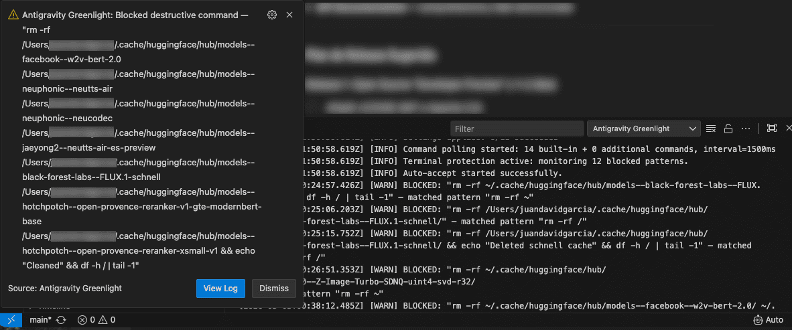

# Antigravity Greenlight

  
  
  
  

Full agent autonomy for Antigravity IDE with active terminal protection.

When you let an AI agent run freely, it needs access to everything: file edits, terminal commands, non-workspace folders, continuation prompts. Today you have two options: click "Allow" dozens of times per session, or flip on raw auto-approve settings and hope the agent doesn't run `rm -rf /` while you're away.

Greenlight gives you a third option. One toggle turns on every execution permission the agent needs. At the same time, a background process watches every terminal command the agent runs and kills anything that matches a configurable blacklist before it finishes executing.

  

## Why not just edit settings.json?

You can set `chat.tools.terminal.autoApprove` and add `{"rm": false}` to block specific commands. This breaks in practice:

1. **Turbo policies override filters.** Antigravity's internal execution policies (`cascadeAutoExecutionPolicy`) bypass `chat.tools` dictionaries entirely.
2. **Static string matching misses real threats.** A shell alias, a chained pipe, or an `npm run clean` script that calls `rm -rf` internally will pass right through a dictionary check.
3. **Too many settings to manage.** Between `ussSettings`, workspace overrides, agent-level permissions, and IDE-level toggles, keeping everything in sync across projects is a headache.

## How Greenlight works

### TerminalGuard

Greenlight hooks into the `onDidStartTerminalShellExecution` API. Every command the agent sends to the terminal is checked against a configurable blacklist (`greenlight.blockedPatterns`).

Default blocked patterns include `rm -rf /`, `rm -rf ~`, `mkfs`, `dd if=`, `> /dev/sda`, fork bombs, and similar system-level destructives. Normal dev commands like `rm file.txt` or `rm -rf node_modules/` are not blocked.

If a match is found, Greenlight sends `\x03` (Ctrl+C / SIGINT) to the terminal within milliseconds, killing the process before it can do damage. A warning notification tells you what was blocked.

You can add your own patterns. Want to block `git push --force` or `drop database`? Add them to `greenlight.blockedPatterns` in your settings.

### Auto-approve injection

When you toggle Greenlight ON, it sets `chat.tools.edits.autoApprove`, `chat.agent.autoApprove`, and the Antigravity-specific execution policies (`cascadeAutoExecutionPolicy`, `browserJsExecutionPolicy`) all at once. When you toggle OFF, it restores your previous values.

For `Agent Non-Workspace File Access`, a one-time manual confirmation is required in Antigravity's settings UI. Greenlight will prompt you with instructions if this hasn't been done.

### Polling dispatcher

Some agent operations stall waiting for a "Continue?" confirmation that never auto-resolves. Greenlight polls `antigravity.command.accept` in the background to clear these locks automatically. Polling frequency scales down when the IDE is idle.

## Install

**From [Open VSX](https://open-vsx.org/extension/codavidgarcia/antigravity-greenlight):** search for **`Antigravity Greenlight @sort:name`** in the Extensions panel.

**From source:**
1. Download the `.vsix` from [Releases](https://github.com/codavidgarcia/antigravity-greenlight/releases/latest).
2. `Cmd+Shift+P` > **Extensions: Install from VSIX...**
3. Pick the file and reload.

## Commands

All commands are available via `Cmd+Shift+P` (or `Ctrl+Shift+P` on Linux/Windows). The status bar item also opens a quick-pick menu with contextual options when clicked.

| Command | What it does |
|---|---|
| `Antigravity Greenlight: Toggle Auto Accept` | Switch between Auto and Manual mode. |
| `Antigravity Greenlight: Enable Auto Mode` | Activate auto-approve directly. |
| `Antigravity Greenlight: Disable Auto Mode` | Deactivate and restore original settings. |
| `Antigravity Greenlight: Show Options` | Open the quick-pick menu (same as clicking the status bar). |
| `Antigravity Greenlight: Toggle Status Bar Visibility` | Show or hide the status bar item. |
| `Antigravity Greenlight: Run Diagnostics` | List all discoverable accept/approve commands in the current environment. |

## Settings

| Setting | Default | What it does |
|---|---|---|
| `greenlight.autoStart` | `true` | Start auto-accepting when the IDE opens. |
| `greenlight.autoApproveEdits` | `true` | Auto-approve file edits from the agent. |
| `greenlight.autoApproveTerminal` | `true` | Auto-approve terminal commands from the agent. |
| `greenlight.autoApproveChat` | `true` | Auto-approve chat and tool invocations. |
| `greenlight.terminalProtection` | `true` | Watch terminal commands and kill blocked patterns. |
| `greenlight.blockedPatterns` | `["rm -rf /", "mkfs", ...]` | Terminal sub-strings to block. Add your own entries. |
| `greenlight.showStatusBar` | `true` | Show the Greenlight item in the status bar. |
| `greenlight.showNotifications` | `true` | Show messages when toggling modes. |
| `greenlight.adaptivePolling` | `true` | Poll faster when active, slower when idle. |
| `greenlight.pollIntervalMs` | `1500` | Base polling interval in milliseconds. |
| `greenlight.maxAgentRequests` | `100` | Max agent requests before "Continue?" prompts. |

## License

[MIT](https://github.com/codavidgarcia/antigravity-greenlight/blob/main/LICENSE)
